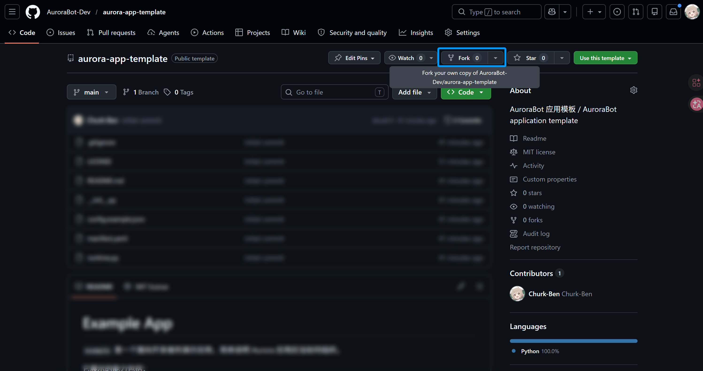
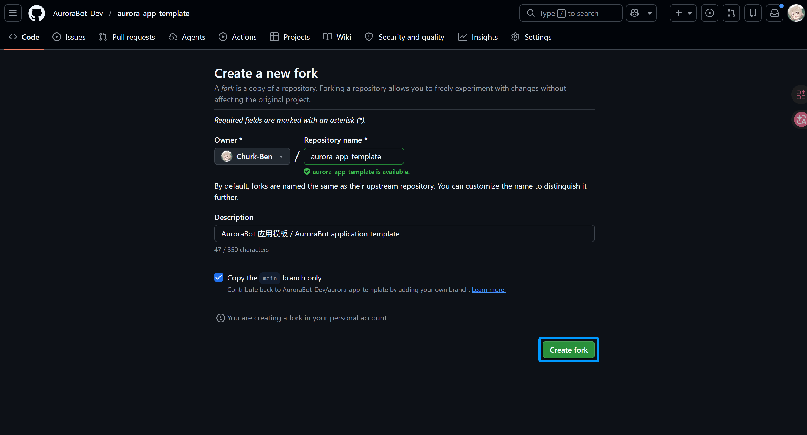
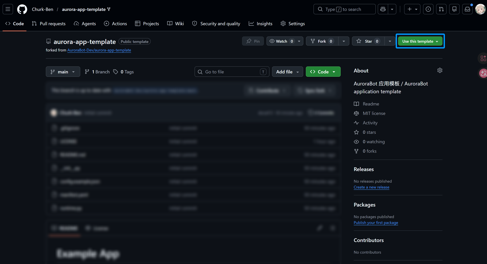
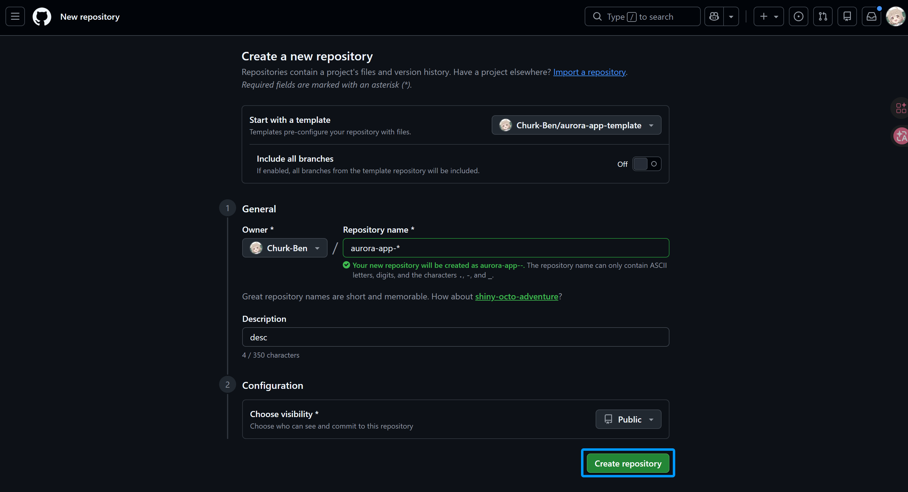

# 示例应用 (AuroraBot-App-Template)

**包名**: `im.polaris.example`

**版本**: 0.1.0

**最低 Brain 版本**: >=4.1.0

Aurora 应用的模板项目, 用于演示应用的最小结构及 PlatformAPI 的主要用法。包含静态命令、动态注册命令、事件上报、日志输出和 app-data 持久化示例。

---

## 指令

### `echo_message` -- 回显文本

回显一段文本, 并上报 `example.echoed` 事件。

| 参数                 | 类型    | 必填 | 说明                             |
| -------------------- | ------- | ---- | -------------------------------- |
| `text`               | string  | 是   | 要回显的文本                     |
| `session_id`         | string  | 否   | 可选会话 ID                      |
| `use_post_intention` | boolean | 否   | 是否通过 post_intention 上报事件 |

| 返回字段      | 类型    | 说明           |
| ------------- | ------- | -------------- |
| `ok`          | boolean | 是否执行成功   |
| `echoed_text` | string  | 实际回显的文本 |
| `package`     | string  | 当前应用包名   |

### `save_note` -- 保存笔记

将一条笔记写入 app-data, 并按需发出 `example.note_saved` 事件。

| 参数         | 类型    | 必填 | 说明             |
| ------------ | ------- | ---- | ---------------- |
| `title`      | string  | 是   | 笔记标题         |
| `content`    | string  | 是   | 笔记内容         |
| `emit_event` | boolean | 否   | 是否发出保存事件 |

| 返回字段     | 类型    | 说明             |
| ------------ | ------- | ---------------- |
| `ok`         | boolean | 是否保存成功     |
| `note_count` | number  | 当前累计笔记条数 |

### `publish_demo_event` -- 发布自定义事件

主动发出一个自定义事件, 演示应用如何向内核上报事件。

| 参数         | 类型   | 必填 | 说明                            |
| ------------ | ------ | ---- | ------------------------------- |
| `event_type` | string | 否   | 事件类型, 默认 `example.custom` |
| `summary`    | string | 否   | 事件摘要                        |
| `session_id` | string | 否   | 可选会话 ID                     |

| 返回字段       | 类型    | 说明               |
| -------------- | ------- | ------------------ |
| `ok`           | boolean | 是否执行成功       |
| `emitted_type` | string  | 实际发出的事件类型 |

### `dynamic_ping` -- 动态注册的 Ping 命令

运行时通过 `PlatformAPI.register_command()` 动态注册, 演示非 manifest 声明式注册。

| 参数    | 类型   | 必填 | 说明      |
| ------- | ------ | ---- | --------- |
| `topic` | string | 否   | ping 主题 |

| 返回字段  | 类型    | 说明          |
| --------- | ------- | ------------- |
| `ok`      | boolean | 是否成功      |
| `message` | string  | pong 响应消息 |

---

## 展示的能力

### 生命周期接口

模板实现了 Aurora 应用完整的生命周期回调:

- `manifest_path()` -- 返回 manifest.yaml 路径, 框架据此加载声明式配置
- `on_start()` -- 应用启动时调用, 加载持久化数据、上报 `example.started` 事件
- `on_stop()` -- 应用停止时调用, 保存数据到磁盘
- `on_tick()` -- 周期性调用 (每 30 tick 写入一次状态快照)

### PlatformAPI 用法示例

通过 `_bind()` 注入的 `PlatformAPI` 提供了以下能力, 模板均有演示:

| API                      | 用途                         | 示例位置                                              |
| ------------------------ | ---------------------------- | ----------------------------------------------------- |
| `api.emit_event()`       | 向内核发送事件               | `echo_message` / `save_note` / `publish_demo_event`   |
| `api.post_intention()`   | 向内核提交意图 (Intent 语义) | `on_start` / `echo_message` (use_post_intention=true) |
| `api.register_command()` | 运行时动态注册命令           | `_bind` 中的 `dynamic_ping`                           |
| `api.log()`              | 结构化日志输出               | 各个方法中均有调用                                    |
| `api.package`            | 当前应用的包名               | 多处使用                                              |
| `api.data_dir`           | 应用专属数据目录             | `_bind` 中初始化文件路径                              |

### 命令注册方式对比

| 方式                        | 命令                                                | 说明                                                                    |
| --------------------------- | --------------------------------------------------- | ----------------------------------------------------------------------- |
| 静态声明 (manifest.yaml)    | `echo_message` / `save_note` / `publish_demo_event` | 在 manifest 的 `commands` 中声明, 框架自动注册                          |
| 动态注册 (register_command) | `dynamic_ping`                                      | 运行时在 `_bind()` 中通过 API 注册, 适合参数/逻辑在运行期才能确定的场景 |

### 事件流

应用发出的事件:

| 事件类型             | 触发时机                                 |
| -------------------- | ---------------------------------------- |
| `example.started`    | 启动时 (通过 `post_intention`)           |
| `example.echoed`     | 执行 `echo_message` 后                   |
| `example.note_saved` | 执行 `save_note` 且 `emit_event=true` 时 |
| `example.custom`     | 执行 `publish_demo_event` 时 (默认)      |

### app-data 持久化

应用数据目录: `data/app_data/im_polaris_example/`

| 文件         | 说明                                             |
| ------------ | ------------------------------------------------ |
| `notes.json` | `save_note` 产生的持久化笔记数据                 |
| `state.json` | 生命周期状态快照 (tick 计数 / 笔记数 / 最后状态) |

---

## 使用

### 作为模板创建新应用

1. 在 GitHub 上 Fork 本仓库

   

   

2. 选择右上角使用此模板

   

   

3. 将仓库克隆到 AuroraBot 的 `apps/` 目录下:

   ```bash
   git clone <你的仓库地址> apps/aurora-app-*
   ```

4. 修改 `manifest.yaml`:
   - `package` -- 改为你的包名 (如 `im.polaris.mine`)
   - `name` -- 改为你的应用名称
   - `version` -- 设为初始版本
   - `commands` -- 替换为你的命令定义

5. 修改 `runtime.py`:
   - 类名改为你的应用类名
   - 实现你的生命周期逻辑和命令处理函数

6. 删除不需要的示例代码, 保留你需要的骨架

### 在 config.yml 中启用

```yaml
apps:
  example:
    enabled: true
    startup:
      greeting: hello from example
      emit_startup_event: true
  # //其他应用//
```

启动参数说明:

- `greeting` -- 启动时 `example.started` 事件携带的欢迎文本
- `emit_startup_event` -- 是否在启动时发出 `example.started` 事件
